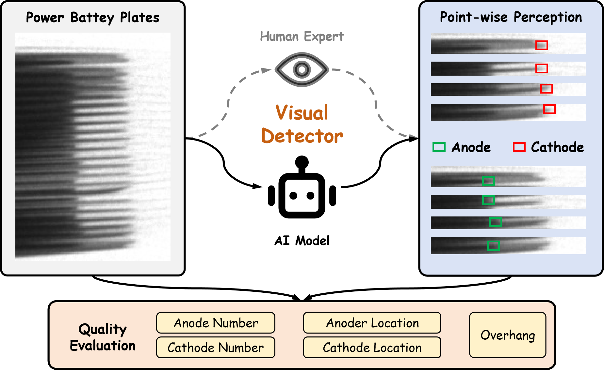
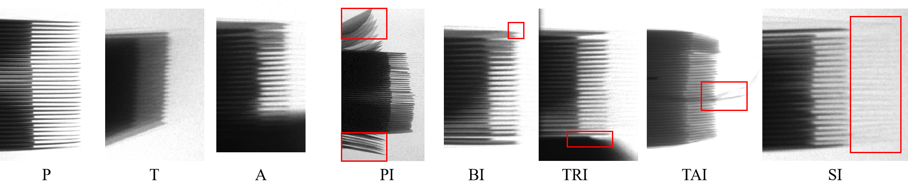
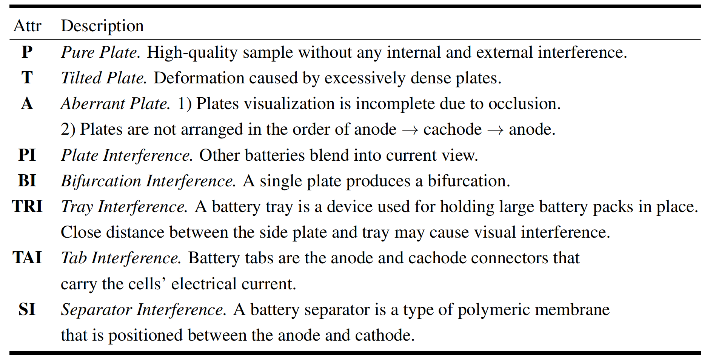
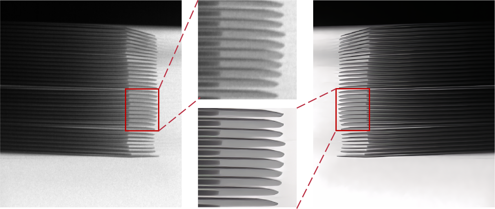
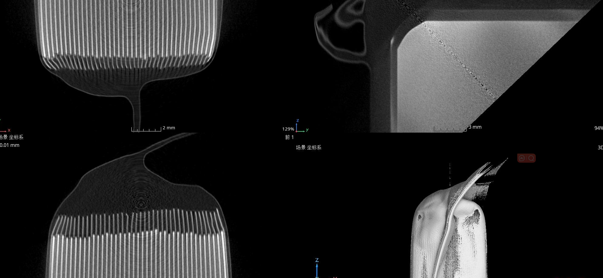
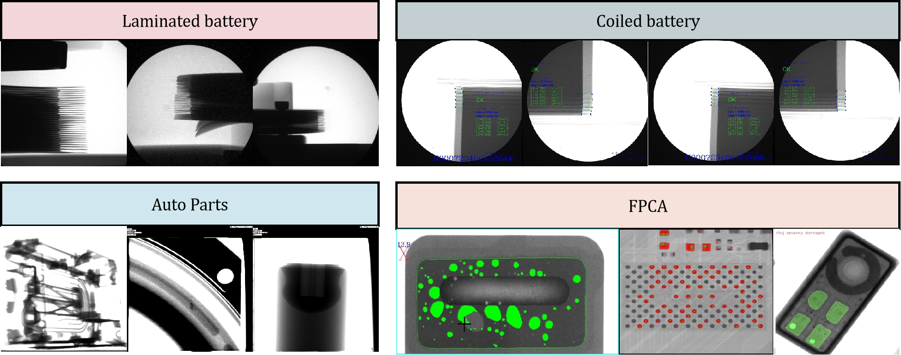
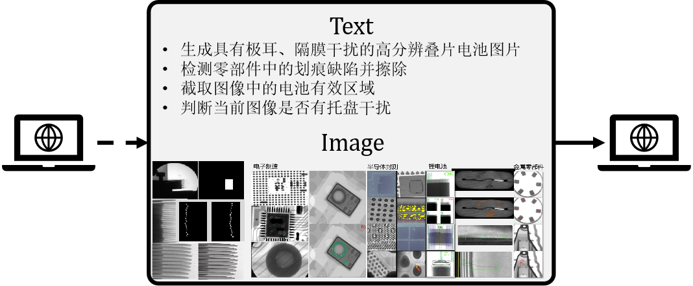

<br />
<p align="center">
  <h1 align="center">Towards Automatic Power Battery Detection:  New Challenge, Benchmark Dataset and Baseline</h1>
  <p align="center">
    CVPR, 2024
    <br />
    <a href="https://xiaoqi-zhao-dlut.github.io/"><strong>Xiaoqi Zhao*</strong></a>
    ·
    <a href="https://lartpang.github.io/"><strong>Youwei Pang*</strong></a>
    .
    <a ><strong>Zhenyu Chen</strong></a>
    .
    <a ><strong>Qian Yu</strong></a>
    ·
    <a href="https://scholar.google.com/citations?hl=zh-CN&user=XGPdQbIAAAAJ"><strong>Lihe Zhang*</strong></a>
    ·
      <a ><strong>Hanqi Liu</strong></a>
    .
     <a ><strong>Jiaming Zuo*</strong></a>
    ·
    <a href="https://scholar.google.com/citations?hl=zh-CN&user=D3nE0agAAAAJ"><strong>Huchuan Lu</strong></a>
  </p>

  <p align="center">
    <a href='https://arxiv.org/pdf/2312.02528v2.pdf'>
      
    </a>
    <a href='https://xiaoqi-zhao-dlut.github.io/xray_pbd_cvpr2024/' style='padding-left: 0.5rem;'>
      
    </a>
  </p>
<br />

## !! If you are interested in Ai4Industury, feel free to contact with us via Email (zxq@mail.dlut.edu.cn, lartpang@mail.dlut.edu.cn)

## Task Definition
<p align="center">
     <br />
</p>
Power Battery Detection (PBD) aims to judge whether the battery cell is OK or NG based on the number and overhang. Therefore, object counting and localization are necessary processing for PBD, which can provide accurate coordinate information for all anode and cathode endpoints.


## Dataset
<p align="center">
     <br />
</p> 

- Statistics of the X-ray PBD dataset. (a) Taxonomic of interference and shots. (b) Overhang distributions. (c) Number distributions. (d) Co-occurrence  distribution of attributes. (e) Multi-dependencies among these attributes.
 
 <p align="center">
     <br />
</p>     

- Examples of various attributes from our X-ray PBD dataset (best viewed zoomed in).
 
 <p align="center">
     <br />
</p> 

- Attribute descriptions.

## Future Works
- How to better model PBD is still an open problem.
- Semi/self-supervised and few-shot learning techniques.
- Extend the PBD dataset to a 3D form with the help of CT device, which can provide richer internal slices information. 
- Ai4Industury-Image Blind Enhancement.
   <p align="center">
     <br />
</p> 

- Ai4Industury-CT Reconstruction.
     <p align="center">
     <br />
</p> 

- Ai4Industury-Multimodal Unified Model.
     <p align="center">
     <br />
</p> 

- Ai4Industury-GPT.
     <p align="center">
     <br />
</p> 

## To Do List

- Release data sets. (to do)
- Release model code. (to do)
- Release model weights. (to do)
- Release prediction maps. (to do)


## Citation

If you think X-ray-PBD codebase are useful for your research, please consider referring us:

```bibtex
@inproceedings{X-ray-PBD,
  title={Towards Automatic Power Battery Detection: New Challenge, Benchmark Dataset and Baseline},
  author={Zhao, Xiaoqi and Pang, Youwei and Chen, Zhenyu and Yu, Qian and Zhang, Lihe and Liu, Hanqi and Zuo, Jiaming and Lu, Huchua},
  booktitle={CVPR},
  year={2024}
```
