# [CVPR'24/arXiv'25] Power Battery Detection

This repo is for the following two works:

**Power Battery Detection** [[Paper]](https://arxiv.org/pdf/2312.02528v2.pdf) 
<br>_Xiaoqi Zhao, Peiqian Cao, Lihe Zhang, Zonglei Feng, Hanqi Liu, Jiaming Zuo, Youwei Pang, Weisi Lin, Georges El Fakhri, Huchuan Lu, Xiaofeng Liu_<br>
In arXiv 2025 (T-PAMI under review)

**Towards Automatic Power Battery Detection:  New Challenge, Benchmark Dataset and Baseline** [[Paper]](https://arxiv.org/pdf/2312.02528v2.pdf) 
<br>_Xiaoqi Zhao, Youwei Pang, Zhenyu Chen, Qian Yu, Lihe Zhang, Hanqi Liu, Jiaming Zuo, Huchuan Lu_<br>
In CVPR 2024


### !! If you are interested in Ai4Industry, feel free to contact with us via Email (xiaoqi.zhao@yale.edu, lartpang@gmail.com)

## News
- Our extension work "**Power Battery Detection**" is available at [arXiv](https://arxiv.org/pdf/2312.02528v2.pdf).
  
## Motivation of Power Battery Detection
| PBD5K |
| --- |
| 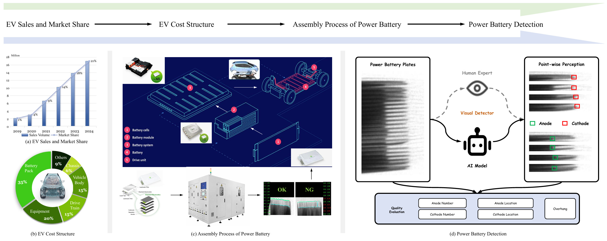 |

 (a) EV sales are rapidly increasing, raising battery safety demands. (b) Battery packs account for ∼35%
 of EV cost, highlighting their critical role. (c) Assembly process of power batteries for EVs, where PBD is applied to the battery cells before assembly. (d)
 Illustration of the power battery detection task.
 
## Dataset
| PBD5K | Co-occurrence distribution of attributes |
| --- | --- |
| 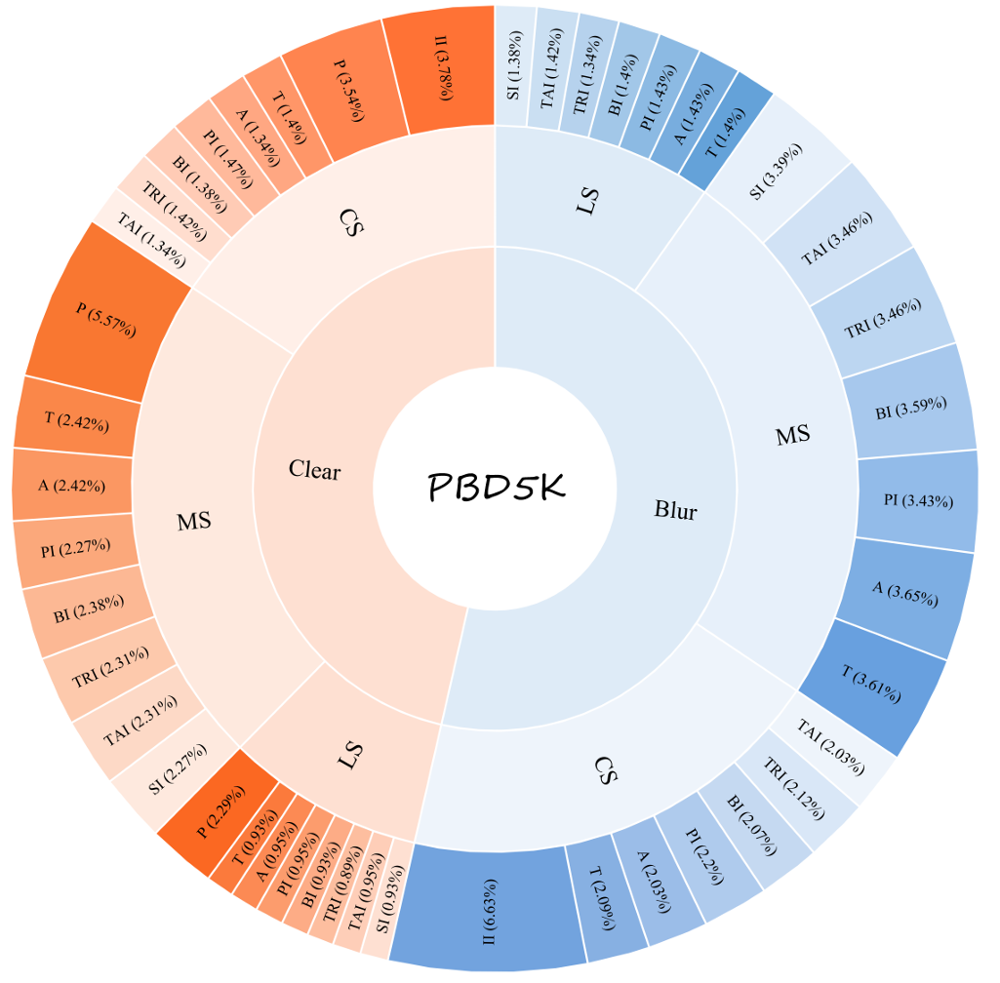 | 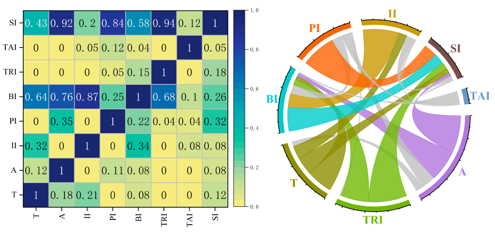 |

|  Structural diversity | Attribute descriptions |
| --- | --- |
| 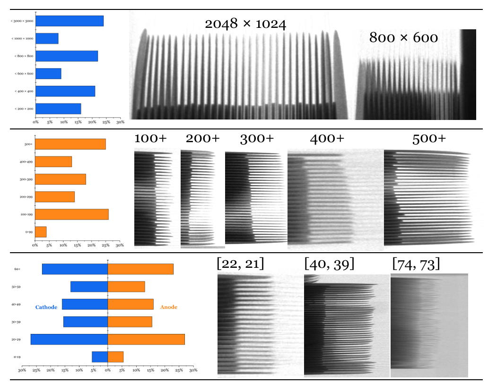 | 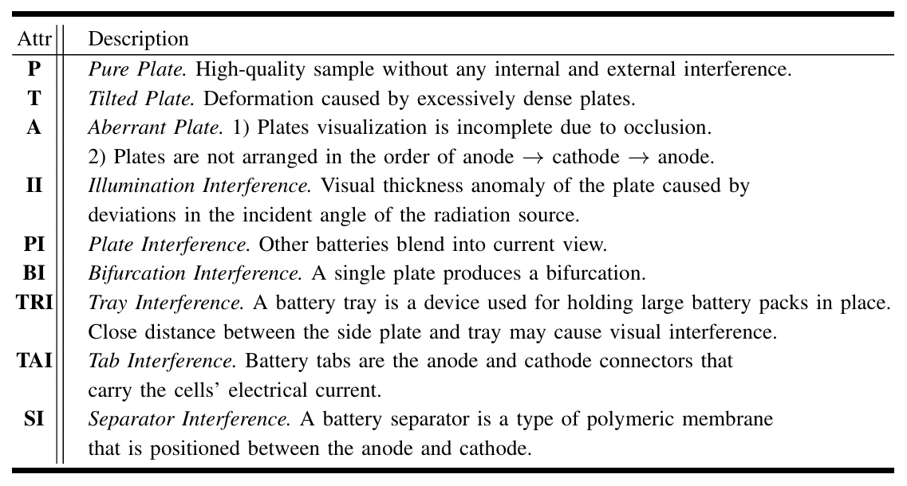 |

|  Visual examples from the PBD5K dataset |
| --- |
| 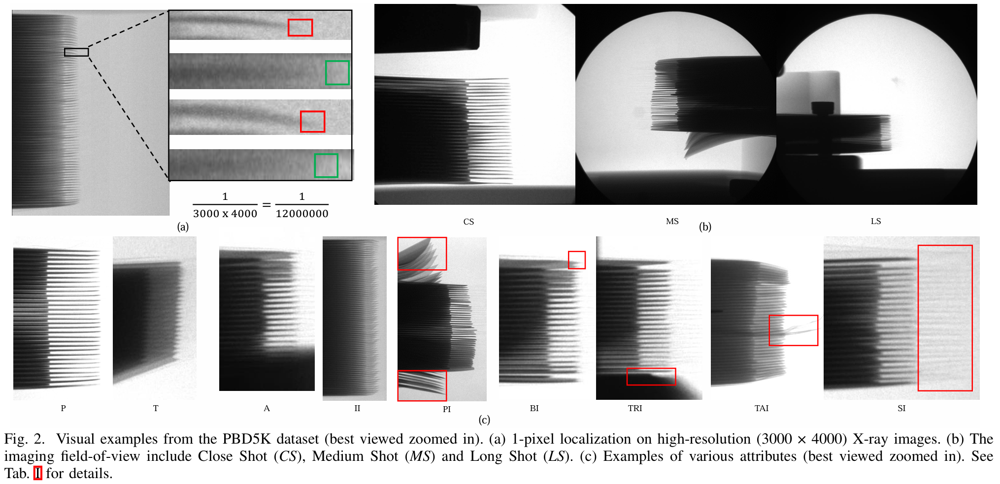 |


## Solution & Framework 
|   Multi-clue mining with point, line and number clues |
| --- |
| 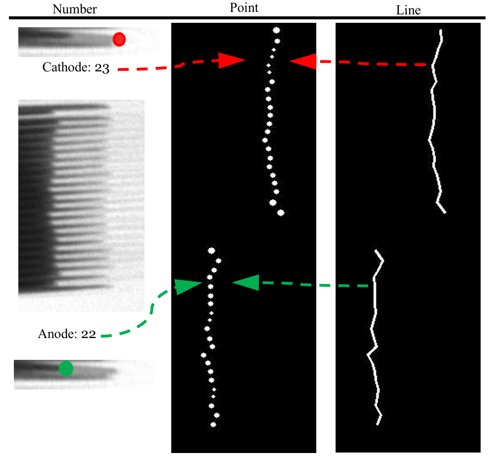 |

|   MDCNeXt |
| --- |
| 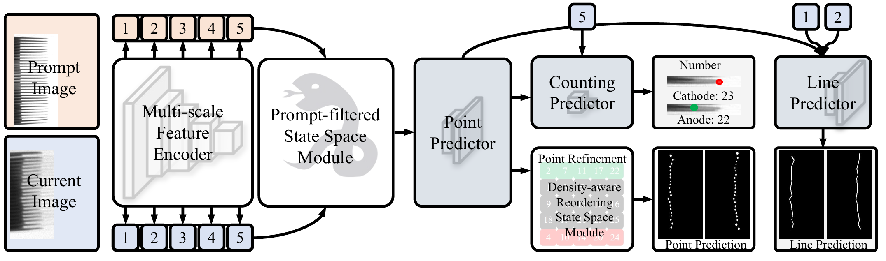 |

## Visual Comparison
|   Qualitative results on regular, difficult,and tough examples with varying attributes |
| --- |
| 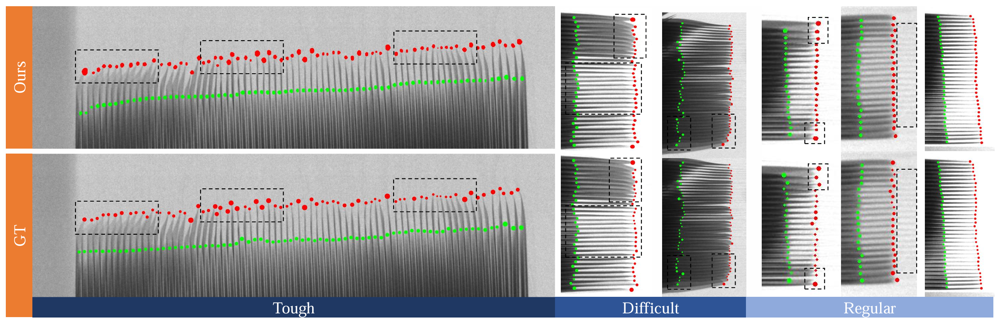 |

|   Visual comparison with other  general/tinyobject detection-based, counting-based,  corner detection-based solutions|
| --- |
| 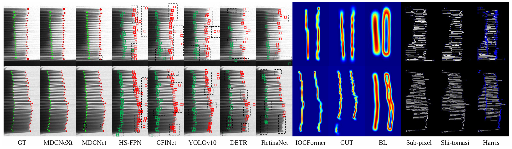 |

|   Visual comparison with different image segmentation methods|
| --- |
| 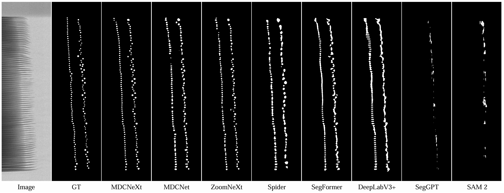 |

## Datasets Link
-  **PBD5K**: [GitHub Release](https://github.com/Xiaoqi-Zhao-DLUT/X-ray-PBD/releases/tag/Dataset)
-  **X-ray PBD (raw data)**: [Google Drive](https://drive.google.com/file/d/1d_b1V9XimIZSVVPxr3WlKaBtUsIGr9Mq/view?usp=sharing)
-  **X-ray PBD (training data processed in MDCNet)**: [Google Drive](https://drive.google.com/file/d/181Ct0wX05Wc5Ac_LCCgMO9q50vmdGky5/view?usp=sharing)

## Trained Model
-  You can download the trained MDCNeXt model at  [GitHub Release](https://github.com/Xiaoqi-Zhao-DLUT/X-ray-PBD/releases/tag/Model_pth)
-  You can download the trained PBD5K_Crop model at  [GitHub Release](https://github.com/Xiaoqi-Zhao-DLUT/X-ray-PBD/releases/tag/Model_pth)
-  You can download the trained MDCNet model at [Google Drive](https://drive.google.com/file/d/1NU0xWcRwipYkgj1YxMABoO-Kd3VRcdPU/view?usp=sharing)

## Prediction Maps
-  You can download the prediction (crop_point_mask, location, original point mask) at  [GitHub Release](https://github.com/Xiaoqi-Zhao-DLUT/X-ray-PBD/releases/tag/Prediction_MDCNeXt)

## To Do List

- [x] Release data sets.
- [x] Release model code.
- [x] Release model weights.


## Citation

If you think X-ray-PBD codebase are useful for your research, please consider referring us:

```bibtex
@inproceedings{X-ray-PBD,
  title={Towards Automatic Power Battery Detection: New Challenge, Benchmark Dataset and Baseline},
  author={Zhao, Xiaoqi and Pang, Youwei and Chen, Zhenyu and Yu, Qian and Zhang, Lihe and Liu, Hanqi and Zuo, Jiaming and Lu, Huchua},
  booktitle={CVPR},
  year={2024}
```
