# 🔋 [IJCV'26 / CVPR'24] Power Battery Detection

This repository provides the dataset, code, trained models, prediction maps, and evaluation tools for our power battery detection works.

---

## 📌 Papers

### 🔥 Power Battery Detection  
[[Paper]](https://arxiv.org/pdf/2508.07797)

_Xiaoqi Zhao, Peiqian Cao, Chenyang Yu, Zonglei Feng, Lihe Zhang, Hanqi Liu, Jiaming Zuo, Youwei Pang, Jinsong Ouyang, Weisi Lin, Georges El Fakhri, Huchuan Lu, Xiaofeng Liu_  

**International Journal of Computer Vision, 2026**

---

### ⚡ Towards Automatic Power Battery Detection: New Challenge, Benchmark Dataset and Baseline  
[[Paper]](https://arxiv.org/pdf/2312.02528v2.pdf)

_Xiaoqi Zhao, Youwei Pang, Zhenyu Chen, Qian Yu, Lihe Zhang, Hanqi Liu, Jiaming Zuo, Huchuan Lu_  

**CVPR 2024**

---

## 🤝 Contact

If you are interested in **AI for Industry**, **power battery inspection**, or **industrial visual intelligence**, feel free to contact us via email:

- 📧 xiaoqi.zhao@yale.edu  
- 📧 lartpang@gmail.com  

---

## 📰 News

- **[2026]** Our extended work **“Power Battery Detection”** has been accepted by **IJCV 2026**. 🎉
- **[2025]** Our extended work **“Power Battery Detection”** is available on [arXiv](https://arxiv.org/pdf/2508.07797). 🔥
- **[2024]** Our benchmark paper **“Towards Automatic Power Battery Detection: New Challenge, Benchmark Dataset and Baseline”** was accepted by **CVPR 2024**. 🚀

---

## 💡 Motivation of Power Battery Detection

| Motivation of Power Battery Detection |
| --- |
| 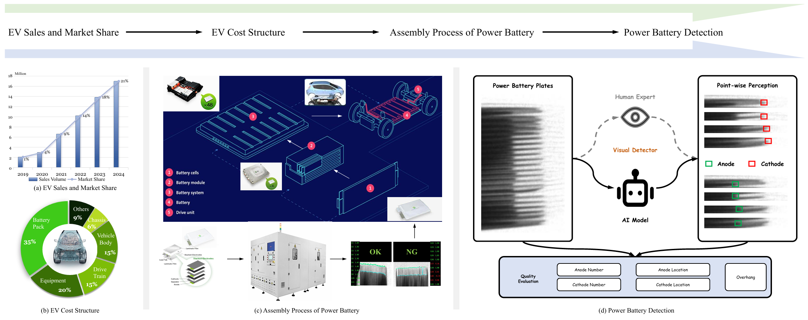 |

(a) EV sales are rapidly increasing, raising higher demands for battery safety.  
(b) Battery packs account for approximately 35% of the total EV cost, highlighting their critical role.  
(c) Assembly process of power batteries for EVs, where PBD is applied to battery cells before assembly.  
(d) Illustration of the power battery detection task.

---

## 📊 Dataset

| PBD5K | Co-occurrence Distribution of Attributes |
| --- | --- |
| 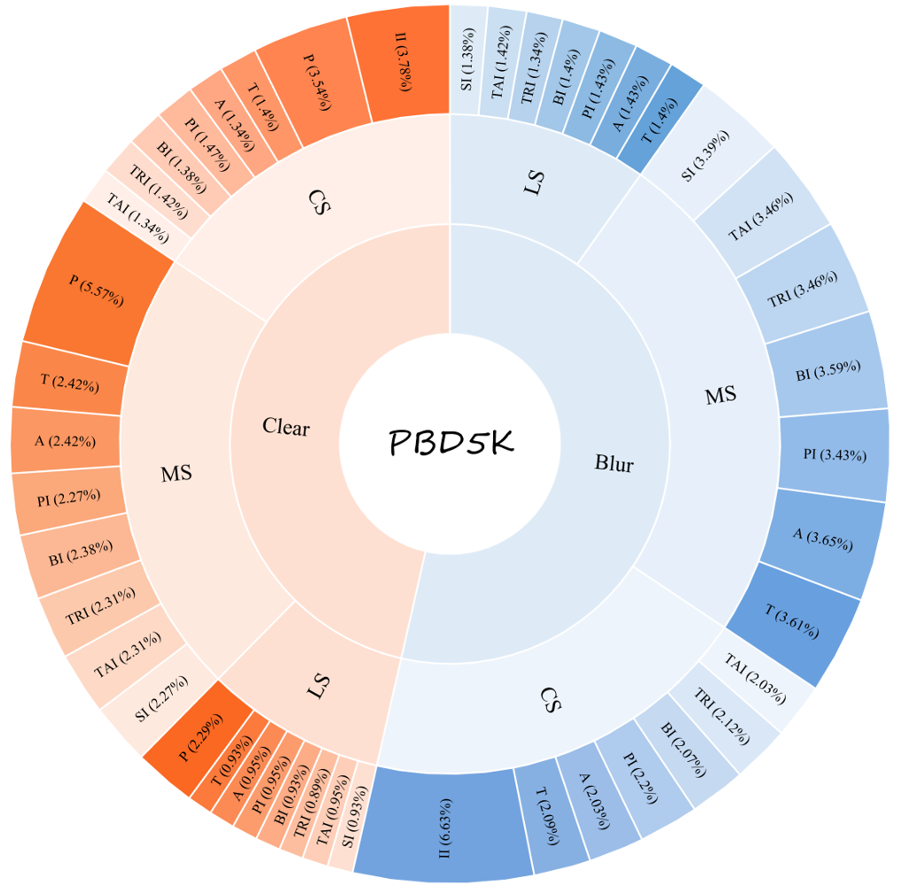 | 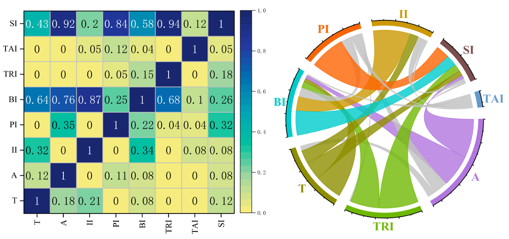 |

| Structural Diversity | Attribute Descriptions |
| --- | --- |
| 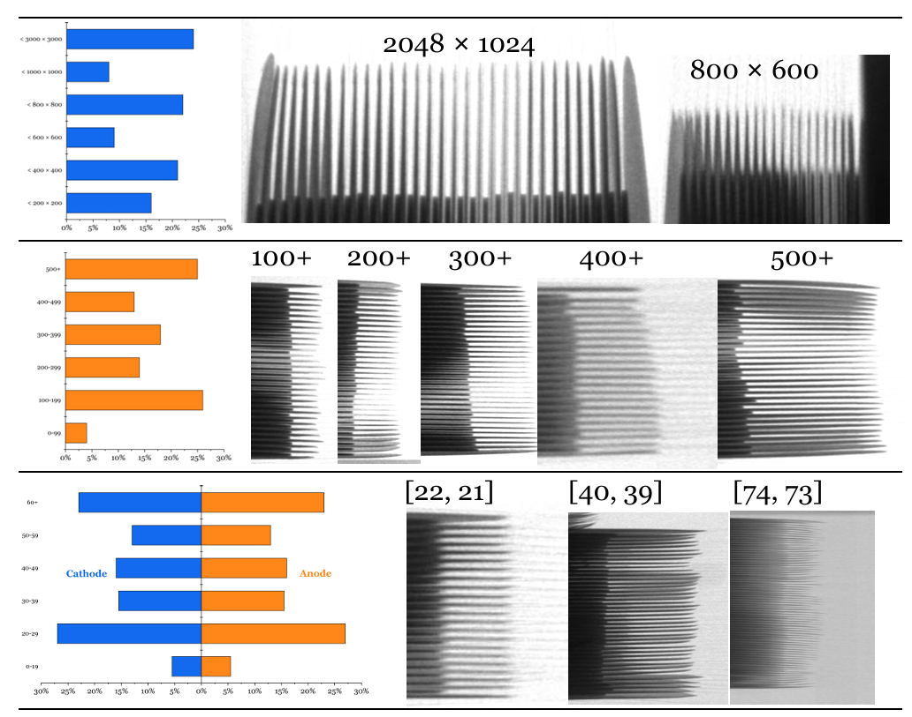 | 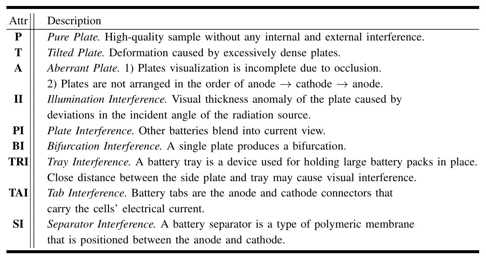 |

| Visual Examples from the PBD5K Dataset |
| --- |
| 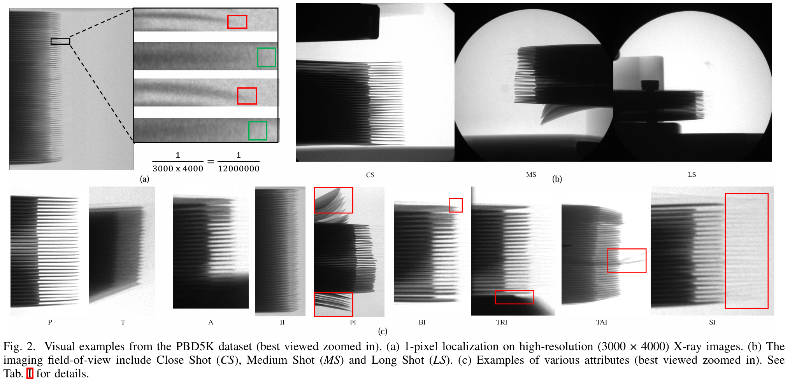 |

---

## 🧩 Solution & Framework

| Multi-clue Mining with Point, Line, and Number Clues |
| --- |
| 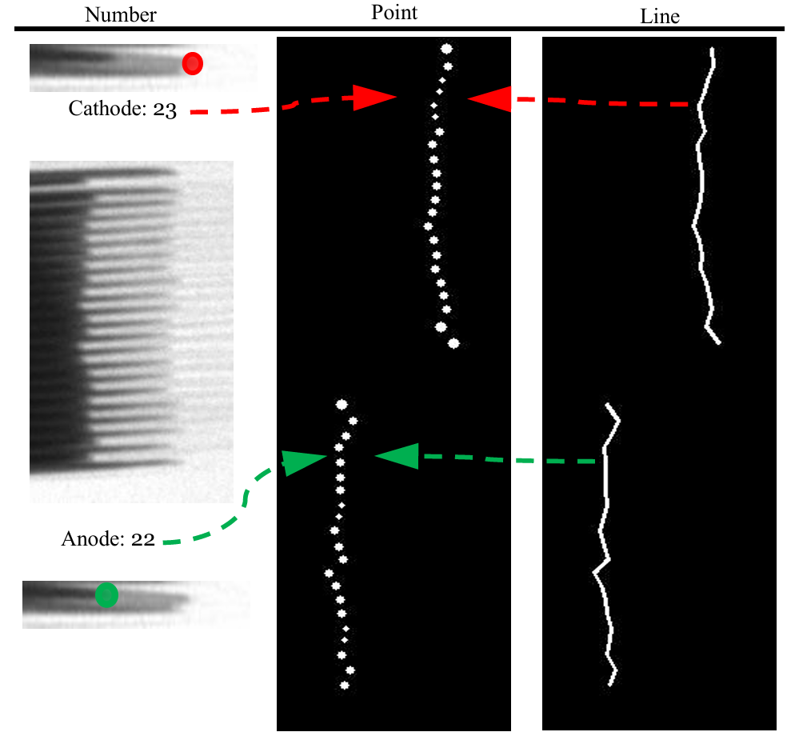 |

| MDCNeXt |
| --- |
| 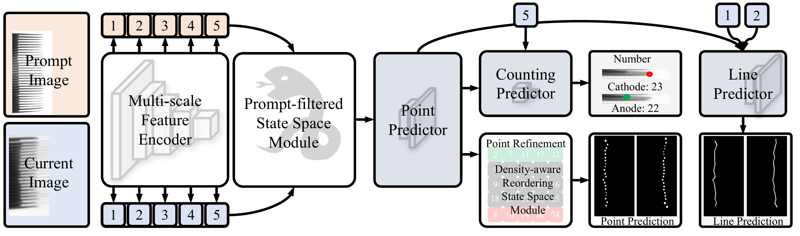 |

---

## 👀 Visual Comparison

| Qualitative Results on Regular, Difficult, and Tough Examples with Varying Attributes |
| --- |
| 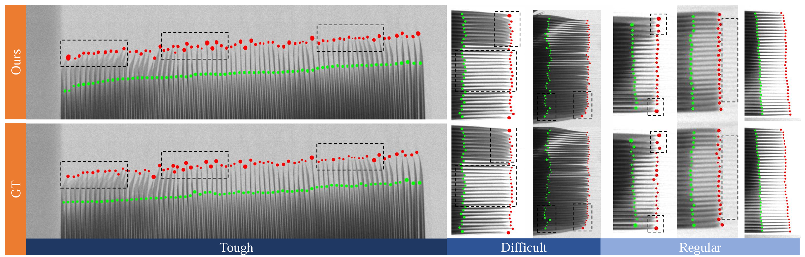 |

| Visual Comparison with General/Tiny Object Detection-based, Counting-based, and Corner Detection-based Solutions |
| --- |
| 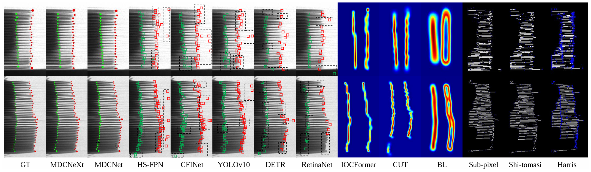 |

| Visual Comparison with Different Image Segmentation Methods |
| --- |
| 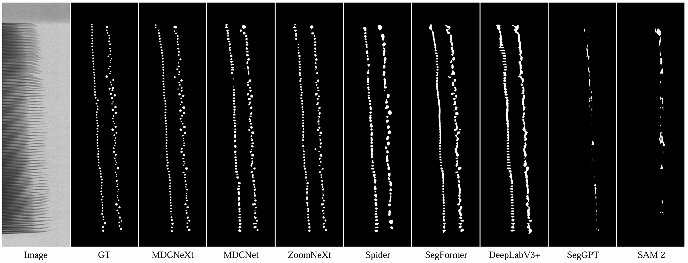 |

---

## 📁 Dataset Links

- **PBD5K**: [GitHub Release](https://github.com/Xiaoqi-Zhao-DLUT/X-ray-PBD/releases/tag/Dataset)
- **X-ray PBD Raw Data**: [Google Drive](https://drive.google.com/file/d/1d_b1V9XimIZSVVPxr3WlKaBtUsIGr9Mq/view?usp=sharing)
- **X-ray PBD Training Data Processed in MDCNet**: [Google Drive](https://drive.google.com/file/d/181Ct0wX05Wc5Ac_LCCgMO9q50vmdGky5/view?usp=sharing)

---

## 🧠 Trained Models

- **MDCNeXt Model**: [GitHub Release](https://github.com/Xiaoqi-Zhao-DLUT/X-ray-PBD/releases/tag/Model_pth)
- **PBD5K_Crop Model**: [GitHub Release](https://github.com/Xiaoqi-Zhao-DLUT/X-ray-PBD/releases/tag/Model_pth)
- **MDCNet Model**: [Google Drive](https://drive.google.com/file/d/1NU0xWcRwipYkgj1YxMABoO-Kd3VRcdPU/view?usp=sharing)

---

## 🚀 Inference

### 1. Configure the Test Dataset Path

After downloading the dataset, edit `utils/config.py` to set the test dataset path:

```python
# utils/config.py
test_data_path = '/path/to/your/test_dataset'
````

### 2. Configure the Model Checkpoint Path

After downloading the pre-trained weights, edit `infer.py` to set the checkpoint path:

```python
# infer.py
ckpt_path = '/path/to/your/model_weights.pth'
```

### 3. Install the `csrc` Module

Download the `csrc` module from [GitHub Release](https://github.com/Xiaoqi-Zhao-DLUT/X-ray-PBD/releases/tag/csrc) and place it in the project directory. The project structure should look like this:

```bash
├── model/
│   └── MDCNeXt.py
├── csrc/
│   ├── ...
│   ├── ...
│   └── setup.py
```

Then install it with:

```bash
cd csrc
python setup.py install
```

### 4. Run Inference

Once the `csrc` module is installed, run:

```bash
python infer.py
```

---

## 🗺️ Prediction Maps

You can download the prediction maps, including `crop_point_mask`, `location`, and `original point mask`, from:

* **Prediction Maps of MDCNeXt**: [GitHub Release](https://github.com/Xiaoqi-Zhao-DLUT/X-ray-PBD/releases/tag/Prediction_MDCNeXt)

---

## 📏 Evaluation

### 1. PBD Metrics

Edit `config.py` to set the dataset root and model prediction path:

```python
# config.py
dataset_root_test = './'   # Path containing the test dataset
Model = ''                 # Prediction path: directory containing both test data and predictions
```

Then run:

```bash
python test_score.py
```

### 2. Segmentation Metrics

For segmentation evaluation, please use our official toolkit:

* [**PySegMetric_EvalToolkit**](https://github.com/Xiaoqi-Zhao-DLUT/PySegMetric_EvalToolkit)

---

## ✅ To Do List

* [x] Release datasets.
* [x] Release model code.
* [x] Release model weights.

---

## 📚 Citation

If you find this repository useful for your research, please consider citing our papers:

```bibtex
@article{zhao2026power,
  title={Power Battery Detection},
  author={Zhao, Xiaoqi and Cao, Peiqian and Yu, Chenyang and Feng, Zonglei and Zhang, Lihe and Liu, Hanqi and Zuo, Jiaming and Pang, Youwei and Ouyang, Jinsong and Lin, Weisi and El Fakhri, Georges and Lu, Huchuan and Liu, Xiaofeng},
  journal={International Journal of Computer Vision},
  year={2026}
}

@inproceedings{zhao2024towards,
  title={Towards Automatic Power Battery Detection: New Challenge, Benchmark Dataset and Baseline},
  author={Zhao, Xiaoqi and Pang, Youwei and Chen, Zhenyu and Yu, Qian and Zhang, Lihe and Liu, Hanqi and Zuo, Jiaming and Lu, Huchuan},
  booktitle={Proceedings of the IEEE/CVF Conference on Computer Vision and Pattern Recognition},
  year={2024}
}
```
